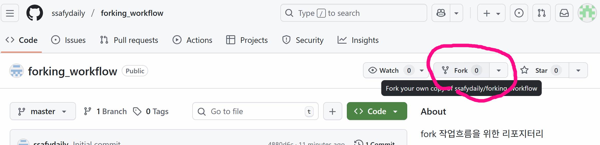
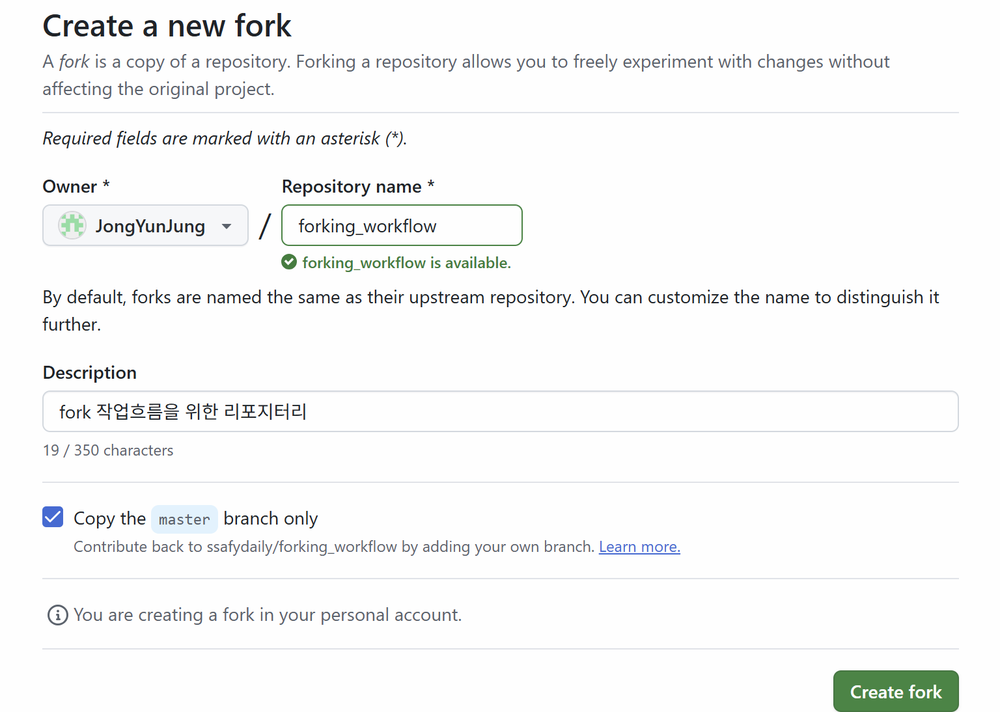
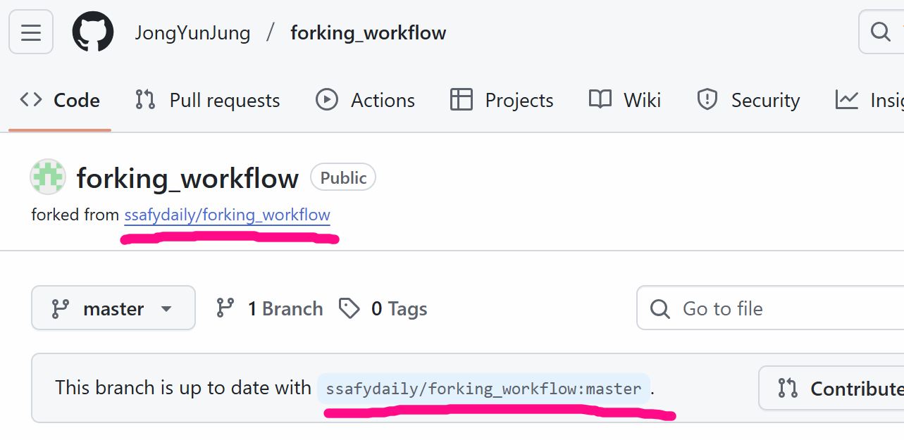
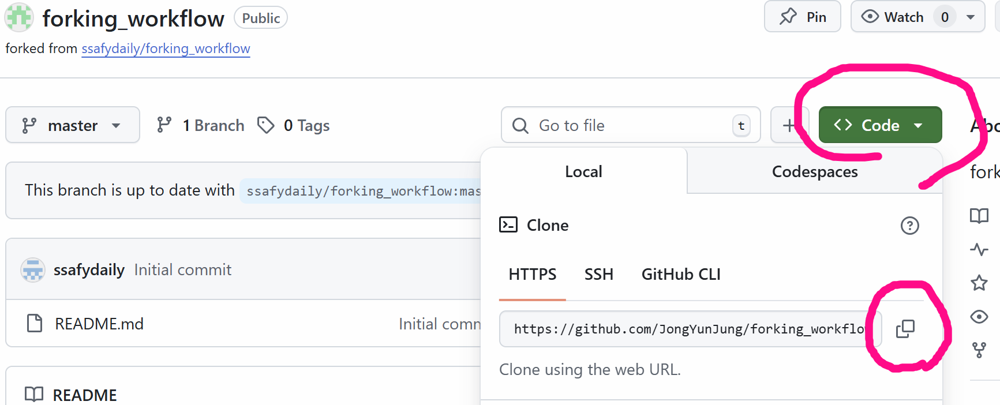
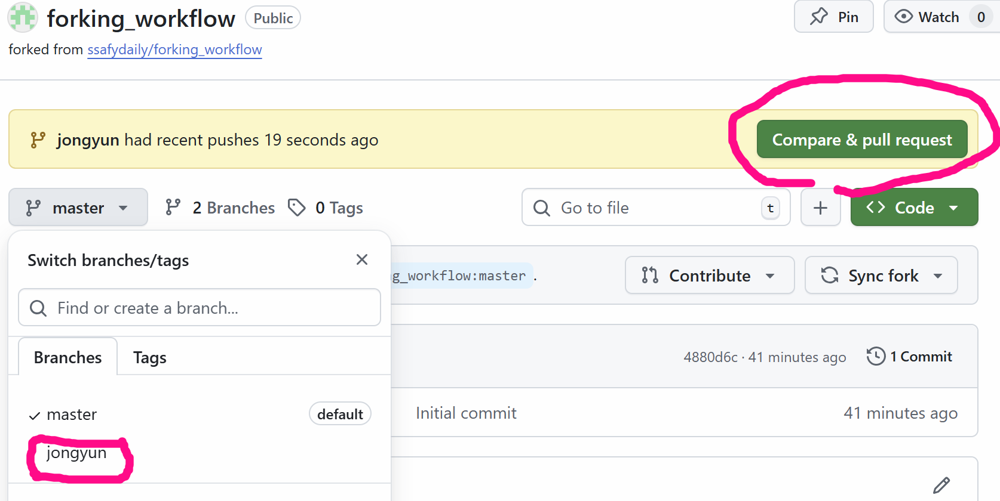
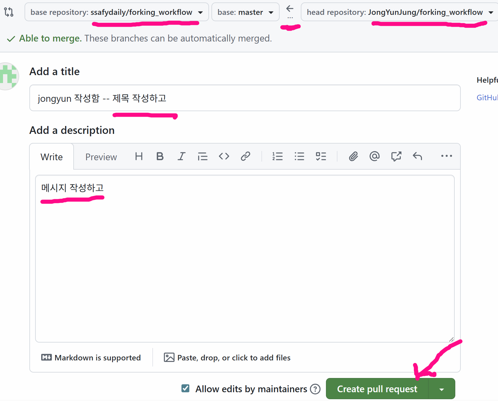
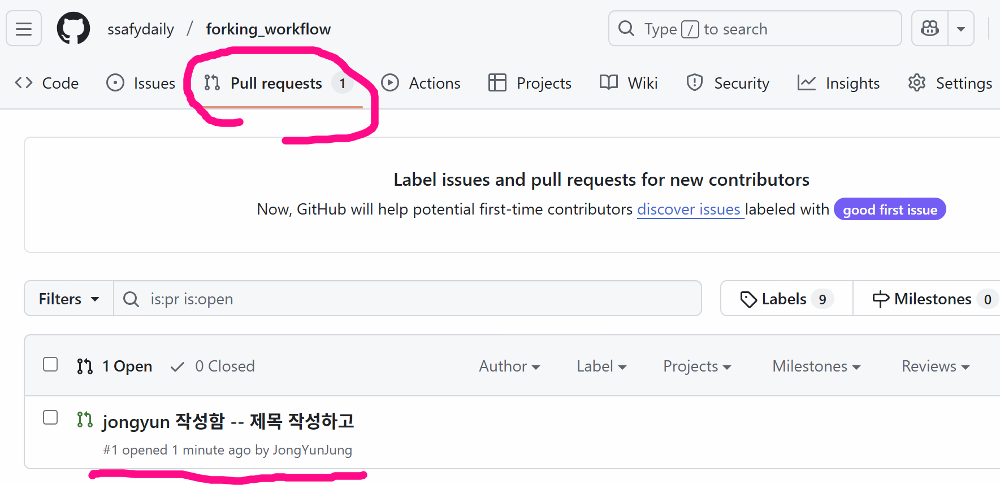
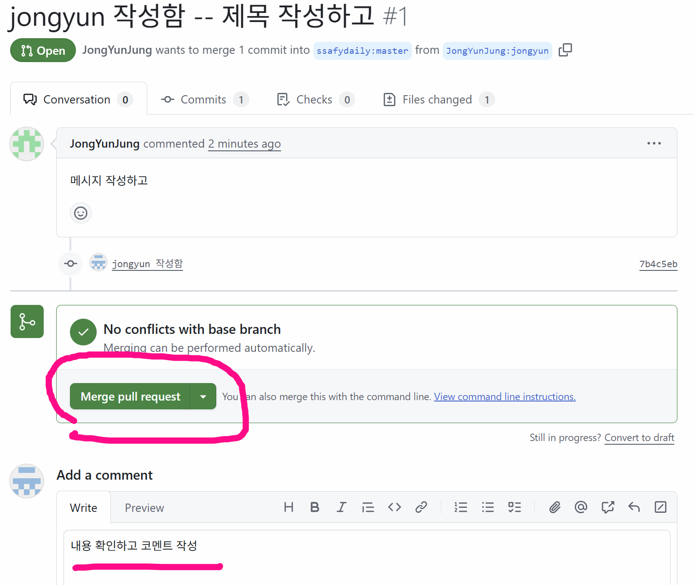
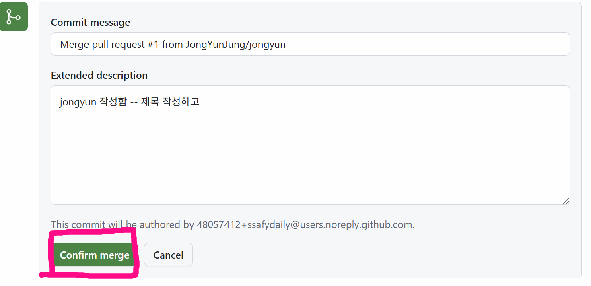

# forking_workflow
fork 작업흐름을 위한 리포지터리

## 1. 대상 저장소를 나의 원격 저장소로 Forking
### fork 버튼 클릭


### 기본 정보 설정하고 `create fork` 클릭


### fork 된 후 결과 확인



## 2. 로컬 저장소로 Clone



```bash
$ git clone [포킹된 저장소 URL]
```

## 3. 원본 원격 저장소와 동기화를 위해 URL 등록
```bash
$ git remote add upstream [원본 URL]
$ git remote add upstream https://github.com/ssafydaily/forking_workflow.git
```
- `git remote -v` 로 확인

## 4. 브랜치 생성 및 기능 구현
```bash
$ git switch -c [브랜치이름(각자 영문이름)]
```
- 충돌을 피하기 위해 개별 폴더를 생성
- `본인영문이름`을 폴더를 작성하고, 내부에 `README.md` 파일을 작성한다.

## 5. 작업 완료 후 원격 저장소에 push
```bash
$ git add .
$ git commit -m '본인이름 포함해서 작성'
$ git push -u origin [생성한 브랜치 이름]
```

## 6. PR 생성
### 원격 저장소에 `push` 하고 원격 저장소 확인


### `Pull request` 생성하기



## 7. 병합 완료
### 원본 저장소 확인


### 원본 저장소에서 병합하기 




## 8. 병합된 `master` 브랜치의 내용을 pull
```bash
$ git swtich master
$ git pull upstream master
```
### 로컬 저장소에 병합이 완료되면 브랜치를 삭제한다.
```bash
$ git branch -d [브랜치이름]
```


